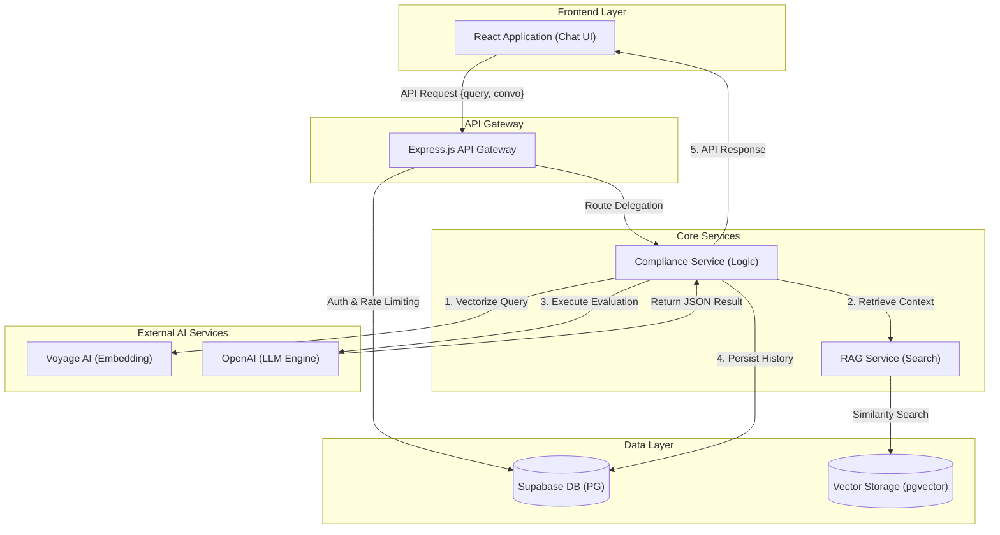

# Project Documentation: FinTech Compliance AI

This document provides a high-level overview of the backend architecture, key features, and a guide for new developers joining the project.

## 🚀 Key Features

### 1. Vector-First Semantic Search (RAG)

The core of the system is the **Retrieval Augmented Generation (RAG)** pipeline. Instead of a basic keyword search, we use vector embeddings to find relevant policy sections.

- **How it works**: Raw PDFs are chunked and converted into 768-dimension vectors using **Voyage AI**. These vectors are stored in **Supabase (pgvector)**.
- **Auto-Detection**: The system automatically identifies which policy is being discussed based on the most relevant vector matches.

### 2. State-Aware Compliance Chat

The AI doesn't just answer questions; it maintains a conversation state.

- **Contextual Memory**: Previous messages are retrieved from the database and fed into the LLM prompt to allow follow-up questions.
- **Structured Output**: Responses are strictly validated using **Zod** to ensure the frontend always receives clean JSON.

### 3. Secure Multi-Tenant Architecture

- Every request is validated against **Supabase Auth**.
- Conversations and messages are logically separated by `user_id`.

---

## 🛠 Developer's Map: "Where is what?"

If you are a new programmer, here is where you find the "brains" of the operation:

| Task / Feature          | File Path                                                                       | Important Function                  |
| :---------------------- | :------------------------------------------------------------------------------ | :---------------------------------- |
| **API Entry Point**     | [compliance.controller.js](./back-end/src/controllers/compliance.controller.js) | `evaluateRequest`                   |
| **Core AI Logic**       | [policy.service.js](./back-end/src/services/policy.service.js)                  | `evaluate`                          |
| **Vector Search (RAG)** | [chunks.service.js](./back-end/src/services/chunks.service.js)                  | `retrieveRelevantChunks`            |
| **Database Ops**        | [databsesaving.service.js](./back-end/src/services/databsesaving.service.js)    | `saveMessage`, `createConversation` |
| **Embedding Gen**       | [embedding.service.js](./back-end/src/services/embedding.service.js)            | `generateEmbedding`                 |
| **Auth Check**          | [auth.middleware.js](./back-end/src/middlewares/auth.middleware.js)             | `requireAuth`                       |

---

## 🏗 System Architecture



---

## 📡 Important Endpoints

### `POST /api/compliance/evaluate`

- **Auth**: Required (Bearer Token)
- **Request Body**:
  ```json
  {
    "query": "string",
    "convo": "uuid (optional, '0' for new chat)"
  }
  ```
- **Response**:
  ```json
  {
    "statusCode": 200,
    "data": {
      "relevant_sections": [],
      "response": "...",
      "conversationId": "..."
    }
  }
  ```
